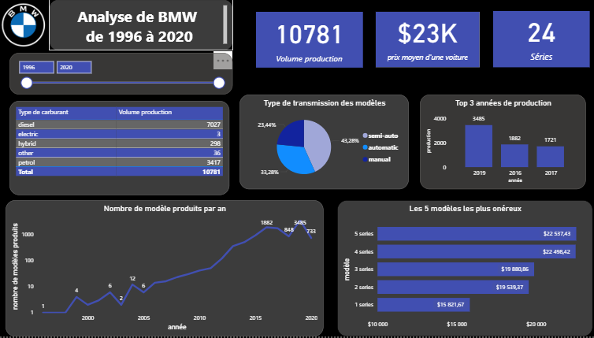
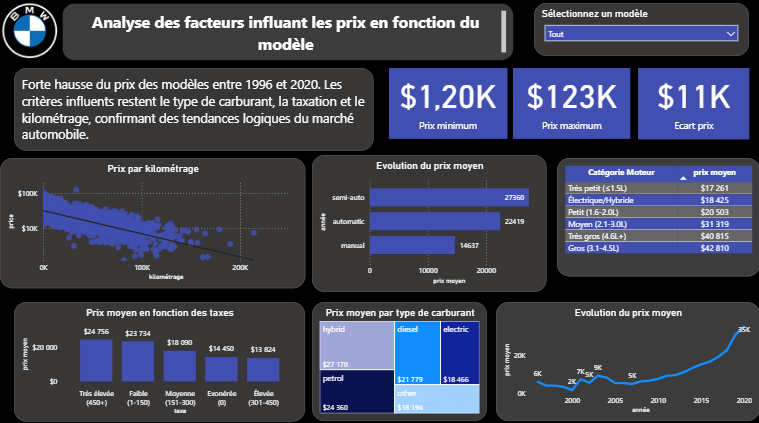

# 🚗 Analyse BMW (1996-2020) - Dashboard Power BI

## 📋 Description du projet

Ce dashboard Power BI propose une analyse complète des véhicules BMW produits entre 1996 et 2020. Il permet d'explorer les tendances de production, l'évolution des prix et les facteurs qui influencent la tarification des différents modèles.

## 📊 Données clés

| Indicateur | Valeur |
|------------|--------|
| Volume de production | 10 781 modèles |
| Prix moyen | $23K |
| Nombre de séries | 24 |
| Période analysée | 1996 - 2020 |

---

## 🖥️ Aperçu du Dashboard

### Page 1 : Vue d'ensemble



Cette page présente une synthèse globale avec :
- **Répartition par type de carburant** : diesel (7027), essence (3417), hybride (298), électrique (3), autres (36)
- **Type de transmission** : semi-auto (43,28%), automatique (33,28%), manuelle (23,44%)
- **Top 3 années de production** : 2019 (3485), 2016 (1882), 2017 (1721)
- **Évolution temporelle** du nombre de modèles produits par an
- **Les 5 modèles les plus onéreux** (Série 5 en tête à $22 537)

---

### Page 2 : Analyse des facteurs de prix



Cette page explore les variables influençant le prix des véhicules :
- **Prix par kilométrage** : corrélation négative entre kilométrage et prix
- **Prix moyen par type de transmission** : semi-auto ($27 360) > automatique ($22 419) > manuelle ($14 637)
- **Prix moyen par catégorie moteur** : de $17 261 (très petit ≤1.5L) à $42 810 (gros 3.1-4.5L)
- **Impact de la taxation** sur le prix moyen
- **Prix par type de carburant** : hybride ($22 120) > diesel ($21 779) > électrique ($18 466)
- **Évolution du prix moyen** dans le temps (forte hausse depuis 2015)

> 📈 **Insight** : Forte hausse du prix des modèles entre 1996 et 2020. Les critères influents restent le type de carburant, la taxation et le kilométrage.

---

### Page 3 : Segmentation du marché


Cette page permet une analyse croisée détaillée :
- **Taux de croissance annuel** : 7,68%
- **Prix moyen par type de transmission**
- **Matrice prix moyen** par type de carburant × catégorie moteur
- **Analyse croisée** transmission × carburant × prix
- **Évolution du volume de production** (pic en 2019 avec 3485 unités)

---

## 🛠️ Technologies utilisées

- **Power BI Desktop** - Visualisation et modélisation
- **DAX** - Mesures et calculs
- **Power Query** - Transformation des données

## 📁 Structure du projet

```
📦 Projets-PowerBI-
 ┣ 🖼️ overview.png
 ┣ 🖼️ price_factors.png
 ┣ 🖼️ segmentation.png
 ┣ 📄 Analyse pricing BMW.pbix
 ┗ 📄 README.md
```

## 🎯 Fonctionnalités interactives

- ✅ Filtres par période (1996-2020)
- ✅ Sélection de modèle spécifique
- ✅ Drill-down sur les visualisations
- ✅ Tooltips personnalisés

## 📈 Principales conclusions

1. **Production en forte croissance** : multiplication par 1000 du nombre de modèles entre 1996 et 2020
2. **Dominance du diesel** : 65% de la production totale
3. **Premium croissant** : les prix moyens ont significativement augmenté, notamment depuis 2015
4. **Transmission semi-automatique** : associée aux prix les plus élevés
5. **Cylindrée = Prix** : corrélation forte entre la taille du moteur et le prix

---

## 👤 Auteur

**Lys** - Master 2 Big Data & Business Intelligence  
*Sorbonne Paris Nord*

---

<p align="center">
  <i>Dashboard réalisé dans le cadre d'un projet d'analyse de données</i>
</p>
